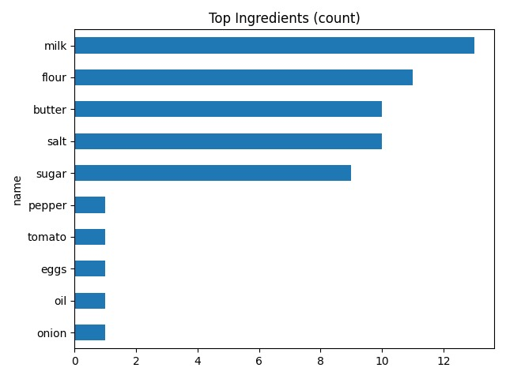
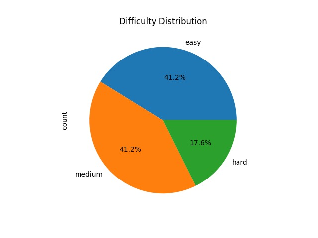
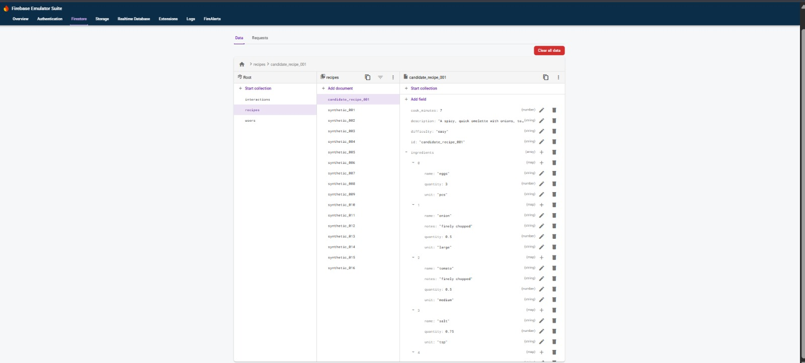
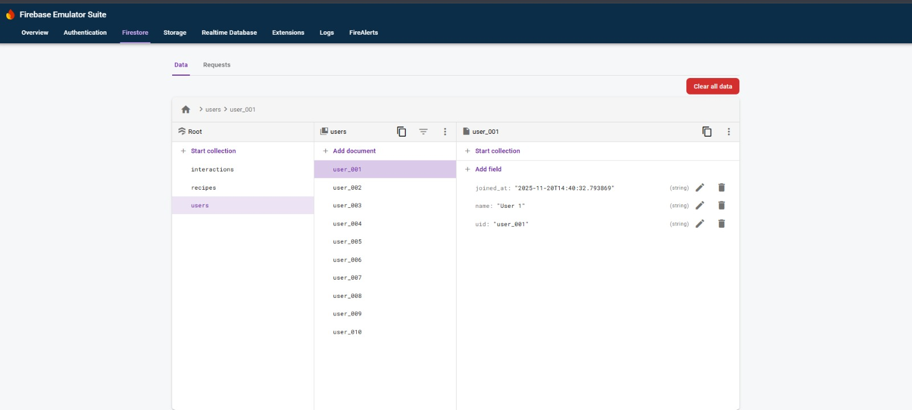
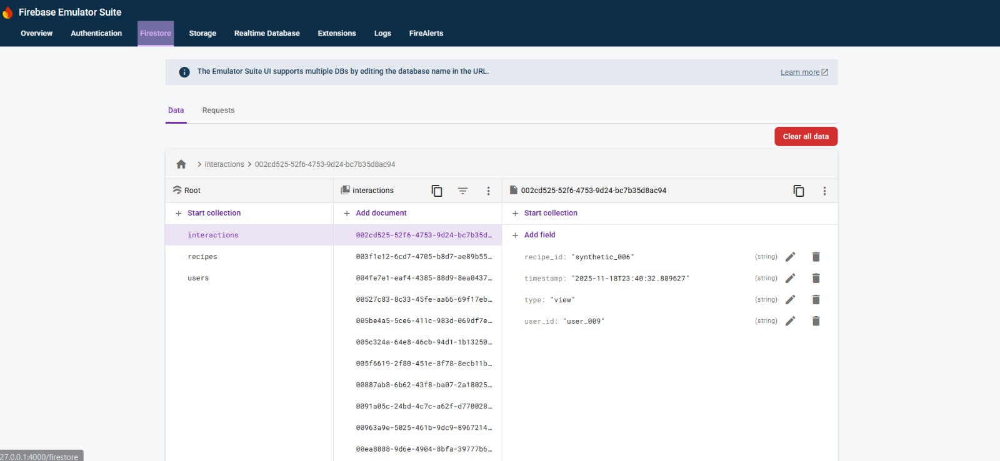

<!-- 📘 Firebase-Based Recipe Analytics Pipeline

A complete end-to-end Data Engineering Pipeline built using the Firebase Firestore Emulator and Python.
This system models recipes and user interactions, seeds Firestore with synthetic data, performs ETL (Export → Transform → Load), validates data quality, and generates analytical insights with visual charts.

🎯 Project Deliverables
✔ 1. Data Modeling
-Design entities for Recipes, Ingredients, Steps, Users, and User Interactions

-Create an ERD diagram showing all relationships

✔ 2. Firebase Source Data Setup
-Add 1 candidate recipe (your own)

-Create 15–20 synthetic recipes

-Generate user interactions: views, likes, ratings

-Seed everything into Firestore Emulator

✔ 3. ETL / ELT Pipeline
-Export Firestore collections to JSON

-Transform JSON into normalized CSV files:

-recipe.csv

-ingredients.csv

-steps.csv

-interactions.csv

-Ensure schema consistency during transformation

✔ 4. Data Quality Validation
-Check required fields

-Detect missing/invalid values

-Validate difficulty levels

-Check for negative numeric values

-Ensure ingredients/steps arrays are not empty

-Generate validation_report.json

✔ 5. Analytics
-Calculate ingredient frequency

-Analyze difficulty distribution

-Compute user engagement patterns

-Identify most liked & most viewed recipes

-Check prep-time vs likes correlation

-Generate: => insights.md
-PNG charts

✔ 6. Documentation
-Complete README with project explanation

-Provide folder structure

-Add step-by-step running instructions

-Include screenshots and output examples

📂 Project Structure
firebase-etl-project/
│
├── seed_data/
│   ├── candidate_recipe.json
│   └── synthetic_recipes.json
│
├── src/
│   ├── seed_firestore.py
│   ├── export_firestore.py
│   ├── transform_to_csv.py
│   ├── validator.py
│   ├── analytics.py
│   └── utils.py
│
├── outputs/
│   ├── raw_json/
│   ├── csv/
│   ├── validation_report.json
│   └── analytics/
│
├── Screenshots/
│   ├── DDistribution.jpeg
│   ├── FB-Interactions.jpeg
│   ├── FB-Recipes.jpeg
│   ├── FB-users.jpeg
│   └── Top-Ingredients.jpeg
│
├── firebase.json
├── .firebaserc
└── README.md

🧩 Data Model (ERD)
Users (1) ----------- (n) Interactions (n) ----------- (1) Recipes

Recipes (1) --------- (n) Ingredients
Recipes (1) --------- (n) Steps

📸 FIRESTORE EMULATOR — SCREENSHOTS
1️⃣ Recipes Collection :


2️⃣ Users Collection:


3️⃣ Interactions Collection:


🚀 How to Run This Project

1️⃣ Start Firestore Emulator
firebase emulators:start --only firestore

2️⃣ Activate Virtual Environment
venv\Scripts\activate

3️⃣ Set Environment Variables
$env:FIRESTORE_EMULATOR_HOST="000.0.0.0:HOSTNO"
$env:GOOGLE_CLOUD_PROJECT="demo-firestore"

4️⃣ Seed the Firestore Emulator
python src\seed_firestore.py


This generates:
-Recipes
-Users
-Synthetic interactions

5️⃣ Export Firestore → JSON
python src\export_firestore.py

Output saved in:
outputs/raw_json/

6️⃣ Transform JSON → Normalized CSV
python src\transform_to_csv.py

Example CSV Chart:


7️⃣ Validate Data
python src\validator.py

Creates:
outputs/validation_report.json

8️⃣ Run Analytics
python src\analytics.py

Generates:
Insights (Markdown)
Charts
Example Chart:

📊 Insights Generated

Most frequent ingredients:


Highest rated & most-liked recipes
Most viewed recipes

Difficulty breakdown


Ingredient popularity
Prep time vs likes correlation
User interaction patterns
Engagement ranking

🧪 Validation Rules
Rule	Description
Required Fields	Title, Ingredients, Steps, Difficulty
Positive Values	Minutes, Quantity
Allowed Difficulty	easy, medium, hard
Non-empty Arrays	Ingredients, Steps
Valid InteractionTypes	view, like, rate

🏁 Conclusion
This project demonstrates a production-ready ETL Data Engineering pipeline using:
1-Firestore (Emulator)
2-Python
3-ETL transformation
4-Data validation
5-Analytical insights

It is ideal for:

🔥 Data Engineering job interviews

🧪 Academic submissions

📊 Portfolio building

🏗 Learning ETL + Firestore -->

# 🔥 Firebase-Based Recipe Analytics Pipeline

A complete end-to-end **Data Engineering Pipeline** built using **Firebase Firestore Emulator** and **Python**. This system seeds Firestore with synthetic recipe data, performs ETL transformations, validates data quality, and generates analytical insights with visual charts.

[](https://www.python.org/downloads/)
[](https://firebase.google.com/docs/emulator-suite)
[](LICENSE)

---

## 📋 Table of Contents

- [Project Overview](#-project-overview)
- [Features](#-features)
- [Architecture](#-architecture)
- [Project Structure](#-project-structure)
- [Data Model](#-data-model)
- [Installation](#-installation)
- [Usage](#-usage)
- [Analytics Output](#-analytics-output)
- [Validation Rules](#-validation-rules)
- [Screenshots](#-screenshots)
- [Technologies Used](#-technologies-used)
- [Contributing](#-contributing)
- [License](#-license)

---

## 🎯 Project Overview

This project demonstrates a **production-ready data engineering workflow** that includes:

- **Data Modeling**: Designed normalized entities for recipes, ingredients, steps, users, and interactions
- **Data Generation**: Synthetic recipe data with realistic user interactions
- **ETL Pipeline**: Extract from Firestore → Transform to normalized CSV → Load for analytics
- **Data Quality**: Comprehensive validation checks ensuring data integrity
- **Analytics**: Automated insights generation with visualization charts

---

## ✨ Features

### 1. **Data Modeling**
- Entity-Relationship Design (ERD)
- Normalized data structure
- Collections: Recipes, Users, Interactions, Ingredients, Steps

### 2. **Firebase Source Data Setup**
- 1 personal candidate recipe
- 15-20 synthetic recipes
- Realistic user interaction patterns (views, likes, ratings)
- Data seeded into Firestore Emulator

### 3. **ETL/ELT Pipeline**
- **Extract**: Export Firestore collections to JSON
- **Transform**: Normalize JSON into relational CSV format
- **Load**: Prepare data for analytics and reporting

**Output CSV Files:**
```
├── recipe.csv
├── ingredients.csv
├── steps.csv
└── interactions.csv
```

### 4. **Data Quality Validation**
- Required field presence checks
- Missing/invalid value detection
- Difficulty level validation (`easy`, `medium`, `hard`)
- Non-negative value constraints
- Array emptiness checks (ingredients, steps)
- Interaction type validation
- Output: `validation_report.json`

### 5. **Analytics & Insights**
- Top ingredient frequency analysis
- Recipe difficulty distribution
- Most liked/viewed recipes ranking
- User engagement patterns
- Preparation time vs. popularity correlation
- Automated chart generation (PNG format)
- Markdown insights report

### 6. **Comprehensive Documentation**
- Detailed README with instructions
- Clear folder organization
- Step-by-step execution guide
- Visual screenshots of outputs

---

## 🏗 Architecture

```
┌─────────────────┐
│ Seed Data       │
│ (JSON Files)    │
└────────┬────────┘
         │
         ▼
┌─────────────────┐
│ Firestore       │
│ Emulator        │
└────────┬────────┘
         │
         ▼
┌─────────────────┐
│ Export to JSON  │
│ (Raw Data)      │
└────────┬────────┘
         │
         ▼
┌─────────────────┐
│ Transform to    │
│ CSV (Normalized)│
└────────┬────────┘
         │
         ├─────────────┐
         ▼             ▼
┌─────────────┐  ┌──────────────┐
│ Validator   │  │ Analytics    │
│             │  │              │
└─────────────┘  └──────────────┘
```

---

## 📂 Project Structure

```
firebase-etl-project/
│
├── seed_data/
│   ├── candidate_recipe.json       # Your personal recipe
│   └── synthetic_recipes.json      # Generated test data
│
├── src/
│   ├── seed_firestore.py          # Seeds Firestore with initial data
│   ├── export_firestore.py        # Exports collections to JSON
│   ├── transform_to_csv.py        # Transforms JSON to normalized CSV
│   ├── validator.py               # Data quality validation
│   ├── analytics.py               # Generates insights and charts
│   └── utils.py                   # Helper functions
│
├── outputs/
│   ├── raw_json/                  # Exported Firestore data
│   ├── csv/                       # Normalized CSV files
│   ├── validation_report.json     # Data quality report
│   └── analytics/                 # Charts and insights
│
├── Screenshots/                    # Project screenshots
│   ├── DDistribution.jpeg
│   ├── FB-Interactions.jpeg
│   ├── FB-Recipes.jpeg
│   ├── FB-users.jpeg
│   └── Top-Ingredients.jpeg
│
├── firebase.json                   # Firebase configuration
├── .firebaserc                     # Firebase project settings
├── requirements.txt                # Python dependencies
└── README.md                       # This file
```

---

## 🧩 Data Model

### Entity Relationship Diagram (ERD)

```
Users (1) ────────── (n) Interactions (n) ────────── (1) Recipes
                                              │
                                              ├── (n) Ingredients
                                              └── (n) Steps
```

### Collections Schema

**Recipes**
- `recipe_id` (string, primary key)
- `title` (string)
- `difficulty` (string: easy/medium/hard)
- `prep_time` (integer, minutes)
- `cook_time` (integer, minutes)
- `servings` (integer)
- `created_at` (timestamp)

**Ingredients**
- `ingredient_id` (string, primary key)
- `recipe_id` (string, foreign key)
- `name` (string)
- `quantity` (float)
- `unit` (string)

**Steps**
- `step_id` (string, primary key)
- `recipe_id` (string, foreign key)
- `step_number` (integer)
- `instruction` (string)

**Users**
- `user_id` (string, primary key)
- `username` (string)
- `email` (string)
- `joined_date` (timestamp)

**Interactions**
- `interaction_id` (string, primary key)
- `user_id` (string, foreign key)
- `recipe_id` (string, foreign key)
- `interaction_type` (string: view/like/rate)
- `rating` (integer, 1-5, optional)
- `timestamp` (timestamp)

---

## 🚀 Installation

### Prerequisites

- Python 3.8 or higher
- Node.js and npm
- Firebase CLI

### Step 1: Clone the Repository

```bash
git clone https://github.com/yourusername/firebase-recipe-analytics.git
cd firebase-recipe-analytics
```

### Step 2: Install Firebase CLI

```bash
npm install -g firebase-tools
```

### Step 3: Set Up Python Environment

```bash
# Create virtual environment
python -m venv venv

# Activate virtual environment
# Windows
venv\Scripts\activate
# macOS/Linux
source venv/bin/activate

# Install dependencies
pip install -r requirements.txt
```

### Step 4: Initialize Firebase Project

```bash
firebase init firestore
```

---

## 💻 Usage

### Step 1: Start Firestore Emulator

```bash
firebase emulators:start --only firestore
```

The emulator will start on `localhost:8080` (default).

### Step 2: Set Environment Variables

**Windows (PowerShell):**
```powershell
$env:FIRESTORE_EMULATOR_HOST="127.0.0.1:8080"
$env:GOOGLE_CLOUD_PROJECT="demo-firestore"
```

**macOS/Linux (Bash):**
```bash
export FIRESTORE_EMULATOR_HOST="127.0.0.1:8080"
export GOOGLE_CLOUD_PROJECT="demo-firestore"
```

### Step 3: Seed Firestore with Data

```bash
python src/seed_firestore.py
```

This generates:
- Recipe documents
- User profiles
- Synthetic user interactions

### Step 4: Export Firestore to JSON

```bash
python src/export_firestore.py
```

Output saved in: `outputs/raw_json/`

### Step 5: Transform JSON to Normalized CSV

```bash
python src/transform_to_csv.py
```

Creates normalized CSV files in: `outputs/csv/`

### Step 6: Validate Data Quality

```bash
python src/validator.py
```

Generates: `outputs/validation_report.json`

### Step 7: Run Analytics

```bash
python src/analytics.py
```

Outputs:
- `outputs/analytics/insights.md` - Detailed insights report
- `outputs/analytics/*.png` - Visualization charts

---

## 📊 Analytics Output

### Generated Insights

1. **Top 10 Most Frequent Ingredients**
   - Bar chart showing ingredient usage across all recipes
   
2. **Recipe Difficulty Distribution**
   - Pie chart of easy/medium/hard recipe breakdown
   
3. **Most Liked Recipes**
   - Ranking of recipes by user engagement
   
4. **Most Viewed Recipes**
   - Top recipes by view count
   
5. **Engagement Patterns**
   - Time-series analysis of user interactions
   
6. **Prep Time vs Popularity**
   - Scatter plot correlating preparation time with likes

### Sample Output




---

## 🧪 Validation Rules

| Rule | Description |
|------|-------------|
| **Required Fields** | Title, Ingredients, Steps, Difficulty must be present |
| **Positive Values** | Time values and quantities must be ≥ 0 |
| **Difficulty Levels** | Must be one of: `easy`, `medium`, `hard` |
| **Non-empty Arrays** | Ingredients and Steps must contain at least one item |
| **Interaction Types** | Must be one of: `view`, `like`, `rate` |
| **Rating Range** | If present, rating must be between 1-5 |
| **Foreign Keys** | All referenced IDs must exist in parent collections |

---

## 📸 Screenshots

### Firestore Emulator - Recipes Collection


### Firestore Emulator - Users Collection


### Firestore Emulator - Interactions Collection


---

## 🛠 Technologies Used

- **Firebase Firestore Emulator** - NoSQL document database
- **Python 3.8+** - Primary programming language
- **Pandas** - Data manipulation and analysis
- **Matplotlib/Seaborn** - Data visualization
- **Firebase Admin SDK** - Firestore interaction
- **JSON** - Data interchange format
- **CSV** - Structured data export

### Python Libraries

```
firebase-admin
pandas
matplotlib
seaborn
python-dotenv
```

---

